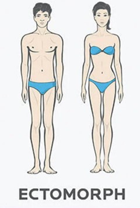

    

---

  <h3 alinhar="centro">🏋️‍♂️ Assistente de Personal Trainer - Gerador de Treino Ideal</h3>
  Este projeto é um desafio de Prompt Engineer, onde o objetivo é criar um prompt que ajude a montar o treino ideal para cada combinação de fatores, como biotipo corporal, disponibilidade de tempo e tipos de exercícios preferidos. O assistente de personal trainer gerado por esse prompt será capaz de personalizar os treinos de acordo com as características e necessidades do usuário.  
  O projeto deve ser feito utilizando as boas práticas de prompt do engenheiro.

---

## 📋 Índice

- [📋 Índice](#📋-índice)
- [📝 Introdução](#📝-introdução)
- [💪 Biótipos Corporais](#💪-biotipos-corporais)
- [📅 Dias Disponíveis para Treino](#📅-dias-disponíveis-para-treino)
- [🏋️ Tipos de Exercícios](#🏋️-tipos-de-exercícios)
- [🛠️ Regras de Negócio](#🛠️-regras-de-negócio)
- [📖 Material de Apoio](#📖-material-de-apoio)
- [🎯 Prompt de Resposta Proposta](#🎯-prompt-de-resposta-proposta)

---

## 📝 Introdução

Este projeto visa criar um assistente de personal trainer automatizado que ajuda a gerar treinos personalizados. O usuário fornecerá informações como o biotipo corporal, a quantidade de dias disponíveis para treinar na semana e o tipo de exercício preferido, e o assistente gerará um plano de treino ideal com base nessas informações.  

---

## 💪 Biótipos Corporais

| **Imagem**                               | **Biótipo**   | **Descrição**                                                               |
|------------------------------------------|---------------|-----------------------------------------------------------------------------|
|  | **Ectomorfo** | Corpo magro, dificuldade em ganhar peso e massa muscular.                  |
|  | **Mesomorfo** | Corpo musculoso, facilidade para ganhar massa muscular e perder gordura.   |
|   | **Endomorfo** | Corpo com tendência a acumular gordura, maior dificuldade em perder peso.  |

> **Nota:** Escolha o biotipo que mais se aproxima do seu corpo atual para que o treino seja mais eficiente.

---

## 📅 Dias Disponíveis para Treino

| **Dias por Semana** | **Tipo de Treino Sugerido**                                                                            |
|---------------------|------------------------------------------------------------------------------------------------------|
| 1 dia              | Corpo Inteiro                                                                                       |
| 2 dias             | Treino A/B (parte superior e inferior)                                                              |
| 3 dias             | Treino ABC                                                                                          |
| 4 dias             | Treino AB/AB (repetição de dois grupos musculares)                                                  |
| 5 dias             | Treino ABCDE                                                                                        |
| 6 dias             | Treino ABCDEF                                                                                       |
| 7 dias             | Treino Diário Funcional                                                                             |

---

## 🏋️ Tipos de Exercícios

| **Tipo de Treino**      | **Descrição**                                                                                     |
|-------------------------|---------------------------------------------------------------------------------------------------|
| **Funcional**           | Exercícios que melhoram movimentos naturais e mobilidade.                                         |
| **Peso Livre**          | Uso de halteres e barras para treinos compostos.                                                 |
| **Maquinário**          | Uso de máquinas para isolar grupos musculares.                                                   |
| **Cardio**              | Atividades para melhorar resistência cardiovascular.                                              |
| **HIIT**                | Treinos de alta intensidade e curtos, excelentes para queima de gordura.                         |
| **Pilates/Alongamento** | Exercícios focados em flexibilidade e fortalecimento do core.                                     |
| **Treino Militar**      | Rotinas intensas baseadas em treinamentos militares.                                              |

---

## 🛠️ Regras de Negócio

1. **Identifique seu biotipo corporal** consultando a seção de biotipos.  
2. **Determine quantos dias por semana você pode treinar** e escolha o tipo de treino mais adequado.  
3. **Selecione o tipo de exercício** que prefira realizar e que se encaixe melhor nos seus objetivos.  
4. **Considere seus objetivos principais**: como perder peso, ganhar massa muscular, ou melhorar a resistência.  
5. **Inclua informações adicionais**, como restrições físicas, nível de condicionamento e equipamentos disponíveis.  
6. **Defina a duração preferida dos treinos**: curtos (20-30 min), moderados (45-60 min) ou longos (> 1 hora).  
7. **Planeje reavaliações periódicas** para ajustar o treino com base no progresso, sugerindo intervalos de 4 a 8 semanas.  

---

## 📖 Material de Apoio

- [Fundamentos de Engenharia de Prompt](https://elidianaandrade.gitbook.io/fundamentos-de-engenharia-de-prompts-com-claude-3)  
- [Boas práticas de Prompt](https://aline-antunes.gitbook.io/otimize-seus-prompts-e-aprenda-mais-usando-ias-1)  

---

## 🎯 Prompt de Resposta Proposta
